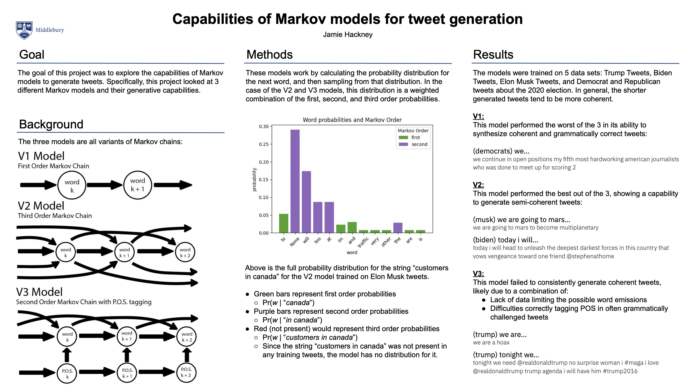

# markov-tweet-generator
Provides 3 trainable models for generating tweets.



### V1
This is the simplest of the three models. It implements a first order markov chain - where each state represents a word - to generate text by sampling from the conditional probability distribution.

### V2
This model performs the best of the 3, and implements a third order markov chain, where again each state represents a word. This model generates text by sampling from a weighted distribution of the first, second, and third order probabilities.

### V3
While I had high hopes for this model, it unforuntaely failed to live up to its potential. It implements a second order markov chain with P.O.S. tagging. In this model, the states are parts of speech which depend only on the previous state and are transitioned between based on probabilities learned from the training data. Each state emits a word, which depends on the previous two words.

### Data
Comes with the following twitter data that has been cleaned up to be usable for the model:

```trump```

Tweets from Donald Trump's twitter account before it was banned, adapted from: https://www.kaggle.com/datasets/austinreese/trump-tweets

```biden```

Tweets from Joe Biden's twitter account, adapted from https://www.kaggle.com/datasets/rohanrao/joe-biden-tweets

```musk```

Tweets from Elon Musk's twitter account, adapted from https://www.kaggle.com/datasets/ayhmrba/elon-musk-tweets-2010-2021

```dem```

Tweets from Democrats about the 2020 election, adapted from https://www.kaggle.com/datasets/kapastor/democratvsrepublicantweets

```rep```

Tweets from Republicans about the 2020 election, adapted from https://www.kaggle.com/datasets/kapastor/democratvsrepublicantweets


### (lack of) Bias Safeguards
These models are all trained on real tweets, and we all know the kind of tweets that can come out of twitter. None of the models currently have any safeguards against generating biased or innapropriate tweets. Use at your own discretion, but I reccomend staying away from prompts that might incentivize the model to generate a biased tweet.

## Running tweet_generator.py
Run the program from the command line with ```python3 tweet_generator.py``` with the following arguments:

```-h``` prints the help message for the arguments.

```-m``` specifies the model to train. Takes one of "v1", "v2", "v3". 

```-d``` specifies the data to train the model on. Takes one of "trump", "biden", "musk", "dem", "rep".

For example, to train the V2 model on Joe Biden tweets, run

```python3 tweet_generator.py -m v2 -d biden```

Once the model is built, you can input a text prompt and will be returned the predicted tweet. The ```V1``` model takes a minimum 1 word as input, the ```V2``` model takes a minimum 3 words as input, and the ```V3``` model takes a minimum 2 words as input.

## Using your own data
To use your own data, add it as an entry into the `data` dictionary in the `main` method. The entry should be in the following format:

```{python}
data_name: {'file': "path/to/data.csv",
            'link': "https://github.com/jamiehax/markov-tweet-generator",
            'size': 34880,
            'column': 7
}
```

`data_name` is the key for your data in the dictionary. It must match whatever string is passed in the `-d` argument.

`file` is the path the the file containing the data. It must be in CSV format.

`link` (optional) is the link to where the data came from.

`size` (optional) is the number of tweets (rows) in the data. Used for the progress bar while processing data/building the model.

`column` is the column of the CSV file containing the tweets.
